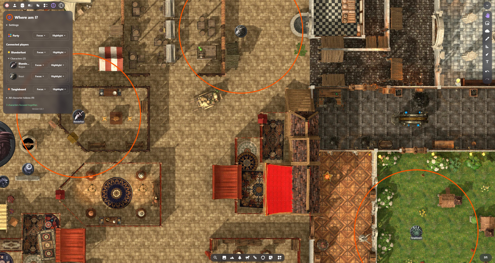
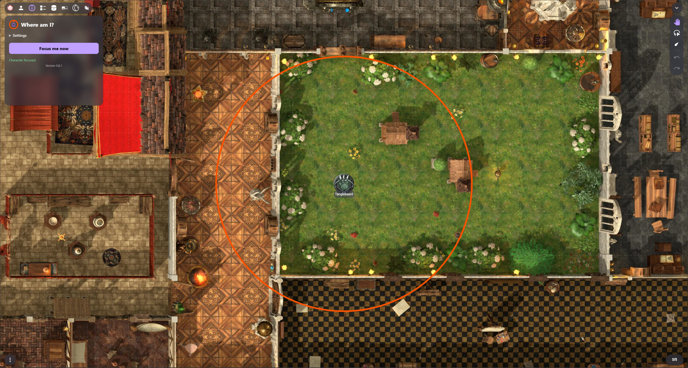
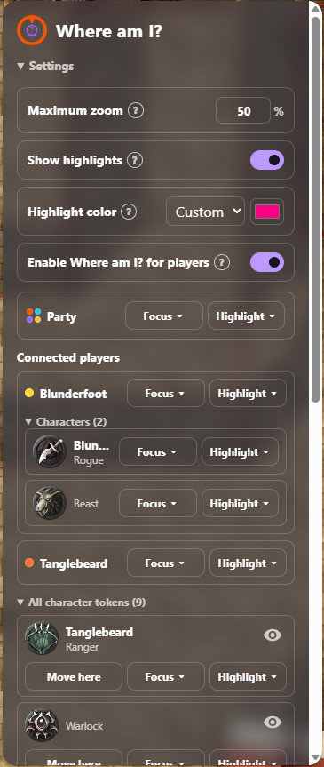
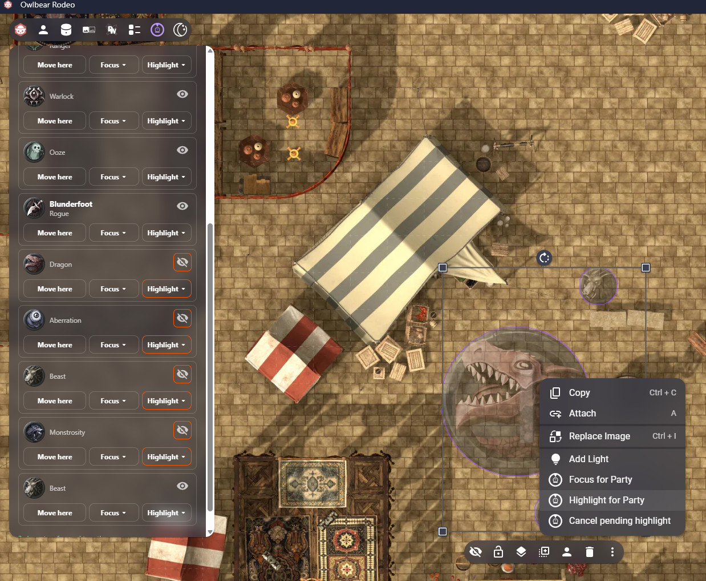
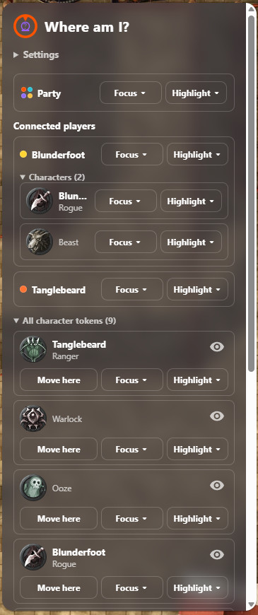
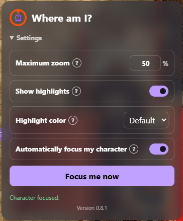

# Where am I?

Where am I? is an [Owlbear Rodeo](https://www.owlbear.rodeo/) extension that
helps players and GMs focus and highlight characters on the current scene.



## For players and GMs

The extension is already hosted. You do not need to download this repository,
build the project, deploy a package, or host your own copy.

### Install the extension

Add this public manifest URL to your Owlbear Rodeo room:

<https://exasperis.github.io/Where-Am-I-/manifest.json>

Once installed by the room's GM, players can open **Where am I?** from the
Owlbear Rodeo extension bar.

### Player controls



- **Automatically focus my character** focuses your character when the
  extension starts and when a new scene becomes ready. It defaults to enabled.
- **Focus me now** frames all your visible characters together.
- **Maximum zoom** controls how closely one selected character is
  framed and caps the closeness of multi-character focus. It defaults to 50%
  and accepts 10–200%.
- **Show highlights** displays a private colored circle around each character
  being found. It defaults to enabled.
- **Highlight color** uses the room's GM color by default or saves a personal
  custom color. If the GM has not chosen a custom room color, the default is
  orange.
- **Settings** collapses the zoom, highlight, and automatic-focus controls and
  remembers its open or closed state per player.
- If you own several visible characters, **My characters** lets you focus one
  named token at a time.

Your automatic-focus, zoom, and highlight settings are saved to your
Owlbear Rodeo player metadata.

### GM controls



- **Enable Where am I? for players** enables or disables player-facing
  behavior for the room.
- Each player and character has **Focus** and **Highlight** menus. **Me** acts
  locally, **Player** acts on the controlling player, and **Party** acts on all
  connected non-GM clients.
- The **Party** tile provides Focus and Highlight actions for **Me** and
  **Party**.
- **All character tokens** provides the same Me/Party actions while retaining
  each token's icon-based Show/Hide control and **Move here** action.
- The GM item context menu can Focus or Highlight any selected items for the
  Party, regardless of item layer.
- Party actions targeting hidden items remain pending until every selected item
  is visible. Orange borders identify the pending visibility and action
  controls; use **Cancel** in that action menu or the GM context menu to cancel
  the whole group. Multiple pending groups are allowed when they do not share
  items.
- **Highlight color** sets the shared room default for players. Its Default
  state is orange, and a Custom color is shared by all GMs.



The responsive panel keeps the same controls accessible with Settings expanded
or collapsed:

| GM settings expanded                                                          | GM settings collapsed                                                                | Player settings                                                                             |
| ----------------------------------------------------------------------------- | ------------------------------------------------------------------------------------ | ------------------------------------------------------------------------------------------- |
|  |  |  |

The GM player list uses Owlbear player names. GM-local actions use the GM's own
saved zoom and highlight settings, while remotely focused players use
their own settings. The panel grows to fit additional rows up to its maximum
height, then scrolls for larger parties.

### Character ownership and privacy

Where am I? includes visible items on the `CHARACTER` layer that were created
by the player. Hidden items and items on other layers are excluded. When a
player owns several visible characters, the extension can frame their combined
bounds with extra scene-grid padding.

In Owlbear Rodeo, a player owns a character token when they created it or when
the GM assigns them through the token's **Owner** menu. To assign existing
tokens, enable **Owner Only** for Characters in **Player Permissions**, then use
each token's Owner menu. Unavailable actions are disabled and show an inline
hint for missing scenes, connections, assignments, or visible tokens.

Each client's viewport acts independently. A player's local action never moves
another client's viewport, and a GM moves a player's viewport only by
explicitly sending that player a focus command.

Highlights use temporary client-local scene items. They never become shared
scene content. An explicit Highlight keeps the scene point at the center of the
recipient's viewport stationary and zooms out only when needed to fit every
highlighted item; it never zooms in or pans toward the target. The rings begin
after any required zoom completes. A Focus waits half a second after viewport
movement before starting its highlight.
Multi-item focus never zooms closer than the recipient's maximum zoom
setting. A successful remote action also shows each affected player a concise
toast naming the GM, action, and selected target.

The extension has no backend, accounts, analytics, or external data storage.
Preferences use namespaced Owlbear Rodeo player metadata, global enablement
uses room metadata, and GM focus requests use Owlbear Rodeo broadcasts.

### Support

For help, bug reports, or feature requests, open a
[GitHub issue](https://github.com/exAsperis/Where-Am-I-/issues).

---

## For developers and contributors

Everything below this point concerns source development, testing, releases,
hosting, and extension-store maintenance. End users do not need these steps.

### Development setup

The project requires Node.js 20 or newer and pnpm 11:

```sh
pnpm install --frozen-lockfile
pnpm run check
pnpm run build
```

Codex Desktop contributors must follow
[`docs/development-environment.md`](docs/development-environment.md), which
documents the bundled toolchain, version synchronization, production base
path, deployment workflow, and OneDrive recovery procedure.

The production build emits `main.html`, `background.html`, the manifest, store
listing, and assets into the ignored `dist/` directory. For GitHub Pages, build
with the repository subpath:

```powershell
$env:VITE_BASE_PATH = "/Where-Am-I-/"
pnpm run build
```

Do not use a local browser preview for Owlbear integration in this workspace.
For a requested release, a passing complete local release gate authorizes the
documented commit, push, deployment, and public-asset verification workflow.
Then test through the hosted manifest in Owlbear Rodeo.

### Extension-store publication

The store listing source is [`public/store.md`](public/store.md), hosted at
<https://exasperis.github.io/Where-Am-I-/store.md>.

To submit the extension, add this entry to the official Owlbear Rodeo
extensions repository's `extensions.json` in a single-commit pull request:

```json
"where-am-i": "https://raw.githubusercontent.com/exAsperis/Where-Am-I-/main/public/store.md"
```

### Manual Owlbear Rodeo release checklist

Use separate signed-in clients where the scenario requires more than one
connection:

1. Player with one owned token joins while enabled.
2. Player with several owned tokens joins while enabled.
3. Player with automatic behavior disabled joins.
4. Enabled player changes scenes.
5. Disabled player changes scenes.
6. Player presses **Focus me now**.
7. One player's local action does not affect another player.
8. GM disables and re-enables the feature without changing player preferences.
9. GM remotely focuses one player without moving other players.
10. GM focuses their viewport on one player and then the whole party.
11. A player has no owned character.
12. A token is hidden.
13. A player joins from two simultaneous connections.
14. Players join and leave while the GM popover is open.
15. Player and GM zoom preferences default to 50%.
16. Each role changes its zoom preference and sees it persist after reopening.
17. A multi-token player focuses each named token individually.
18. GM player rows use Owlbear player names rather than token names.
19. The extension bar and manifest use the orange/blue logo artwork.
20. Expand and collapse GM character lists, then exercise every valid Focus and
    Highlight recipient option plus each token's Show/Hide and Move actions.
21. Confirm one private highlight circle per focused token for automatic, manual,
    remote, player, GM, multi-token, and whole-party focus.
22. Disable highlights independently on GM and player clients, reload, and
    confirm each preference persists.
23. Trigger another focus during an animation and confirm the previous
    highlights are removed.
24. Confirm the translucent blurred panel grows for four players (including
    two expanded two-character players) and scrolls for larger parties.
25. Collapse and expand Settings as both roles, reopen the panel, and confirm
    each player's state persists.
26. As GM, select Character and non-Character items and verify context-menu
    Focus for Party and Highlight for Party on separate player clients.
27. Set a custom GM highlight color and confirm players using Default inherit
    it; clear the shared custom state and confirm their Default resolves to
    orange. Confirm a player's Custom selection persists independently.
28. Focus widely spaced and tightly grouped multi-token selections and confirm
    neither zooms closer than the recipient's maximum zoom setting.
29. Send Player and Party actions and confirm each affected player sees one
    concise toast naming the GM, action, and target.
30. Confirm player character lists remain inside their player card border, the
    Party card uses its four-color icon, and each all-token row aligns **Move
    here**, **Focus**, and **Highlight** beneath its top-right visibility icon.
31. Open every setting's question-mark help control with mouse and keyboard,
    dismiss it with Escape and outside-click, and confirm the dark-mode color
    menu uses dark option backgrounds.
32. With Characters → Owner Only disabled, confirm unavailable player and GM
    actions explain how to enable it and assign a token owner.
33. Enable Owner Only, assign and unassign token owners, hide and show assigned
    tokens, and connect and disconnect players; confirm buttons and the single
    highest-priority inline hint update without reopening the panel.
34. Disable remote player actions and confirm GM **for Me** actions remain
    usable while **for Player** and **for Party** entries are disabled.
35. Trigger Highlight with targets inside, outside, and spanning opposite
    viewport edges. Confirm the scene point at the visible viewport center stays
    fixed, including for targets beyond the top or left edge; Highlight must
    never pan toward the target or zoom in, must zoom out only as far as needed,
    and must begin the rings after the zoom completes. Owlbear's internal
    Position X/Y may change to compensate for the center-anchored scale.
36. Queue Focus for Party and Highlight for Party on hidden Character and
    non-Character items. Confirm orange eye/action borders, GM setup toasts,
    conditional context-menu cancellation, and whole-group cancellation.
37. Queue multiple disjoint groups, then try overlapping and cross-action
    groups. Confirm the entire conflicting request is rejected with an error
    naming the occupied item and existing action.
38. With a mixed visible/hidden group, confirm nothing executes until every
    target is visible. Disconnect players or disable remote actions before
    showing the targets, then confirm the group waits and uses the Party
    connected when eligibility returns. Repeat with two GM clients and verify
    players execute each group once.
39. Reveal a pending target while observing a player client under network
    latency. Confirm the action executes even if the action broadcast reaches
    that client just before its local visibility update.

Also confirm concise feedback for an absent scene, an absent character, a
completed focus, a disabled global feature, and a sent remote command. Check
keyboard focus visibility and both Owlbear light and dark themes.
